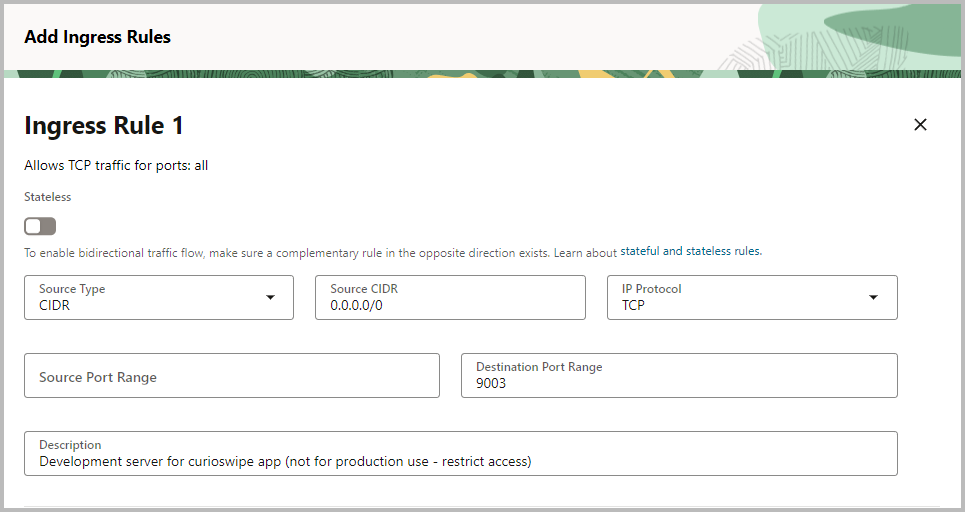

Scaffoling the django backend

### Add Ingress Rule
For development servers, we are using 9000 series ports - like 9001, 9002.
So, selected 9003 port for curioswipe development server  
**Steps to Add Ingress Rule for Port 9003 in OCI**  
→ Log in to Oracle Cloud Console → Sign in  
→ Navigate to Compute → Instances  
→ Find and click on your instance (the one with IP `129.154.40.152`).  
→ Find the Primary VNIC  
→ In the instance details, look for the "Primary VNIC" and click on it.  
→ Go to Subnet Details → In the VNIC details, click on the subnet name (this will take you to the subnet details).  
→ Find Security Lists → In the subnet details, you’ll see a section for "Security Lists".  
→ Click on the security list name (usually something like `Default Security List for ...`).  
→ Add Ingress Rule → Refer screenshots below




### Configure IPTABLES on VM
```
ubuntu@whatever:~/projects/curioswipe/backend$ sudo iptables -I INPUT   -m state --state NEW -p tcp --dport 9003 -j ACCEPT 
```

### Creating the project

```
python3 -m venv backend/venv && source backend/venv/bin/activate && pip install django djangorestframework oracledb
```

```
source backend/venv/bin/activate && django-admin startproject curioswipe backend/curioswipe
```

```
source backend/venv/bin/activate && python backend/manage.py migrate
```

backend/curioswipe/settings.py  
`ALLOWED_HOSTS = ['*']`

```
python manage.py runserver 0.0.0.0:9003
```