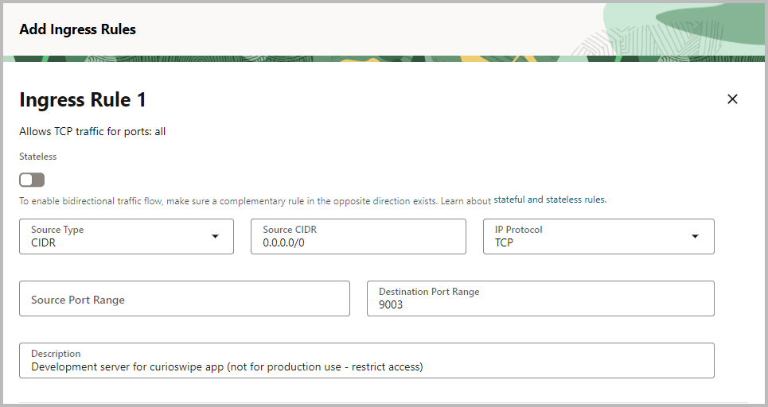
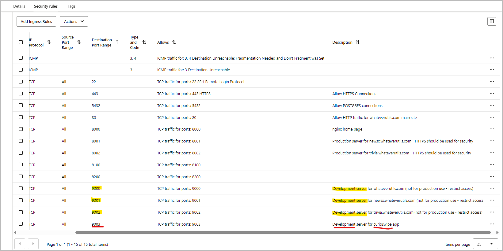

# CurioSwipe – Working Notes

## 🚦 Current Status

- Django backend project scaffolded under `backend/curioswipe/`.
- Dev server accessible on port `9003` and confirmed accessible via `http://129.154.40.152:9003/`.
- Oracle Autonomous Database schemas (`curioswipe_dev` and `curioswipe_prod`) are created and integrated.
- All migrations applied successfully; new tables verified using SQL Developer.
- `.env` file added for secure storage of database credentials.
- `settings.py` updated to dynamically load environment variables using `environ`.
- Dependencies installed from `requirements.txt` to ensure compatibility.
- API endpoints implemented for `topics` and `categories` with full CRUD functionality.
- Swagger endpoint exists at `/swagger/` but is currently not functional.

---

## 🛠️ Next Steps

1. **Mobile App Development**
   - Scaffold the Android app using Kotlin and Jetpack Compose.
   - Implement a basic swipeable UI for topics.
   - Integrate Retrofit or Ktor for API communication.

2. **Backend Enhancements**
   - Add token-based authentication for API endpoints.
   - Implement filtering and pagination for `/api/topics/` and `/api/categories/` endpoints.

3. **Testing**
   - Perform end-to-end testing between the backend and mobile app.
   - Verify API responses and database interactions.

4. **Documentation**
   - Update README.md and tech-stack.md with recent changes.
   - Document API usage and endpoints for developers.

---
---
---


---

## ✅ Initial Setup

**Ingress Rule:**  
*For development servers, we are using 9000 series ports - like 9001, 9002.  
So, selected 9003 port for curioswipe development server*  
**Steps to Add Ingress Rule for Port 9003 in OCI**  
→ Log in to Oracle Cloud Console → Sign in  
→ Navigate to Compute → Instances  
→ Find and click on your instance (the one with IP `129.154.40.152`).  
→ Find the Primary VNIC  
→ In the instance details, look for the "Primary VNIC" and click on it.  
→ Go to Subnet Details → In the VNIC details, click on the subnet name (this will take you to the subnet details).  
→ Find Security Lists → In the subnet details, you’ll see a section for "Security Lists".  
→ Click on the security list name (usually something like `Default Security List for ...`).  
→ Add Ingress Rule → Refer screenshots below



- **Configure IPTABLES on VM**  
    ```
    ubuntu@whatever:~/projects/curioswipe/backend$ sudo iptables -I INPUT   -m state --state NEW -p tcp --dport 9003 -j ACCEPT 
    ```
- **Python Environment:**  
    ```
    python3 -m venv backend/venv
    source backend/venv/bin/activate
    pip install django djangorestframework oracledb
    ```

- **Django Project Scaffold:**  
    ```
    source backend/venv/bin/activate
    django-admin startproject curioswipe backend/curioswipe
    python backend/manage.py migrate
    ```

- **Settings:**  
  - `ALLOWED_HOSTS = ['*']` in `backend/curioswipe/settings.py`

- **Run Dev Server:**  
    ```
    python manage.py runserver 0.0.0.0:9003
    ```
    Access the page via: http://129.154.40.152:9003/

## 🔹 Oracle ADB Schemas

- `curioswipe_dev` and `curioswipe_prod` schemas have been created in Oracle Autonomous Database (ADB) with password `Offline@1235`.
- Both have been granted CONNECT, RESOURCE, and object creation privileges.

### 🗒️ Executed Oracle SQL Commands

The following SQL commands were executed to set up the schemas and privileges:

```sql
-- Create development user/schema
CREATE USER curioswipe_dev IDENTIFIED BY "Offline@1235"
DEFAULT TABLESPACE data
QUOTA UNLIMITED ON data;

GRANT CONNECT, RESOURCE TO curioswipe_dev;
GRANT CREATE SESSION, CREATE TABLE, CREATE VIEW, CREATE SEQUENCE, CREATE PROCEDURE TO curioswipe_dev;

-- Create production user/schema
CREATE USER curioswipe_prod IDENTIFIED BY "Offline@1235";

ALTER USER curioswipe_prod DEFAULT TABLESPACE data;
ALTER USER curioswipe_prod QUOTA UNLIMITED ON data;

GRANT CONNECT, RESOURCE TO curioswipe_prod;
GRANT CREATE SESSION, CREATE TABLE, CREATE VIEW, CREATE SEQUENCE, CREATE PROCEDURE TO curioswipe_prod;
```

---

